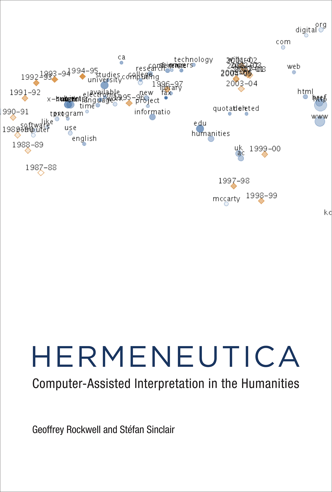
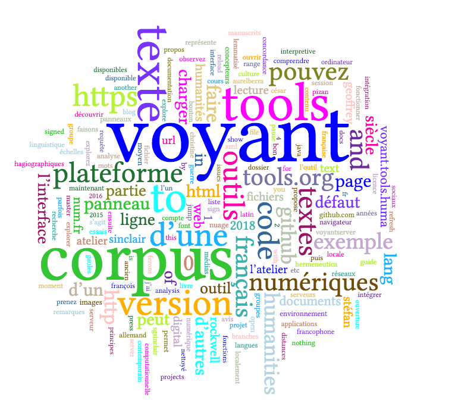
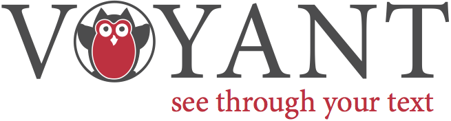

# Introduction à Voyant Tools

[Voyant Tools](http://voyant-tools.org/) est un environnement d’analyse, de lecture et de visualisation de textes numériques. Cette plateforme fait partie d’un projet plus vaste, présenté dans ce livre : Rockwell Geoffrey et Sinclair Stéfan, *[Hermeneutica](http://hermeneuti.ca/). Computer-Assisted Interpretation in the Humanities*, Cambridge, Massachusetts, MIT Press, 2016.

*Ce document contient la structure et les matériaux d’un atelier francophone d’introduction à Voyant Tools de trois heures. Il se fonde notamment sur un bref [tutoriel disponible sur le site Hermeneuti.ca](http://hermeneuti.ca/intro-workshop), sur des [ateliers antérieurs](http://docs.voyant-tools.org/category/workshops/) assurés par les concepteurs de la plateforme et sur la [documentation en cours de révision](https://voyant-tools.org/docs/#!/guide/tutorial).*

---

## Notre programme 

Le but de cet atelier est de vous accompagner dans la découverte de Voyant Tools. Voici le parcours que je vous propose pour comprendre le projet de cette plateforme, guider votre regard dans son interface, vous aider à y analyser des corpus et – qui sait ? – nous faire réfléchir sur le sens et l’intérêt de ces explorations :

1. À propos de Voyant Tools
2. Distances de lecture
3. Faisons le tour de l’atelier numérique
4. Explorez vos corpus !
5. Et ensuite ?

Je vous invite à participer à tout moment. Si vous le voulez bien, nous ferons en revanche des présentations rapides dans la seconde partie de l’atelier, après la pause, lorsque chacun reconnaîtra ses intérêts de recherche en lisant la liste des corpus.

---

## 0. Préparatifs

Je vous recommande vivement d’installer la version serveur de Voyant Tools sur votre machine, en suivant ces consignes : <https://github.com/sgsinclair/VoyantServer/wiki/VoyantServer-Desktop>. Cette version vous permettra de faire fonctionner la plateforme localement, sans besoin d’une connexion Internet, sans recours à une mémoire cache et donc en respectant les droits sur les documents et d’éventuels besoins de confidentialité, et surtout plus vite et plus souplement, grâce à la possibilité de relancer le serveur s’il est ralenti ou planté et de manier plus aisément de gros corpus. De plus, aucun risque d’accabler les serveurs au moment de charger les corpus, par exemple pendant un atelier…

Il s’agit simplement de télécharger et décompresser le dossier « VoyantServer2_4-M7.zip » dans le dossier où vous mettez vos applications (prenez la dernière version, quel que soit son numéro), de lancer l’application en double-cliquant sur le fichier « VoyantServer.jar » (votre ordinateur vous demandera peut-être d’[installer Java](https://www.java.com/fr/download/)) et d’attendre que votre navigateur s’ouvre à l’adresse locale par défaut, http://127.0.0.1:8888/ (appuyer sur le bouton « Open Web » a le même effet).

Si vous souhaitez explorer un corpus qui vous est familier, il vous suffira de disposer d’un ou de plusieurs fichiers dans un format courant (texte brut de préférence, éventuellement HTML ou XML, voire PDF), ou bien de connaître l’URL d’une page où le texte est accessible librement.

Vous pouvez faire des essais avant l’atelier pour vous assurer que votre version locale fonctionne aussi bien que la version en ligne, <http://voyant.tools.huma-num.fr> (miroir de <https://voyant-tools.org>).

## 1. À propos de Voyant Tools

> Voyant Tools is a web-based text analysis, reading and visualization environment. Developed by a small team of digital humanities scholars led by Stéfan Sinclair and Geoffrey Rockwell, Voyant Tools is designed for a very wide range of applications and users, from students to researchers and journalists to market analysts. It strives to balance user-friendliness with a range of analytic and interpretive functions. (Fichier [*Readme*](https://github.com/sgsinclair/Voyant/blob/master/README.md) de l’entrepôt GitHub contenant le code de Voyant Tools)

* Étapes du projet
    * Depuis les années 1990 : Humanities Computing et Digital Humanities au Canada (cf. [TAPoR](http://tapor.ca/home), the Text Analysis Portal for Research)
    * Dans les années 2000 : HyperPo
    * Avant 2015 : Voyeur (Flash et Java)
    * Depuis 2015 : Voyant 2.0 (HTML5, amélioration des filtres de requête, outils fondés sur le calcul de proximité et les séquences d’éléments, ou *n-grams*)
* Principes
    * Ouverture du code, ouverture à la contribution
    * Manipuler, explorer, fouiller les corpus textuels (les Text Analysis Recipes de TAPoR étaient des « recettes »)
    * « [S]howing how analytical tools *are* instantiations of interpretive methods that can be woven closely into other hermeneutical things, like text » (*Hermeneutica*, p. 4)
* Voyant et moi (ou : pourquoi je suis ici)
    * Je me souviens du [Day of DH](http://stefansinclair.name/rapid-analysis-dayofdh11/) de Stéfan Sinclair de 2010… Je découvrais ce champ de recherche et cette communauté.
    * Depuis 2014, j’utilise Voyant Tools dans mon enseignement : au premier semestre du master [Humanités classiques et humanités numériques](https://classnum.hypotheses.org/1125), pour initier à l’analyse textuelle, outiller l’exercice des pastiches savants et faire toucher du doigt les avantages et les limites d’une plateforme généraliste.
    * En 2016, j’ai réalisé la traduction française de l’interface, à la suite d’une discussion sur la liste « [Digital Humanities](https://groupes.renater.fr/sympa/info/dh) ».
    * En 2017-2018, j’ai produit des listes de [*stopwords* pour le grec et le latin](https://github.com/aurelberra/stopwords), qui ont été intégrées à Voyant Tools.
* Il existe une tension entre l’idéal, ou la tentation, de l’outil unique omnipotent et la lente acquisition d’une culture computationnelle donnant accès à des outils spécialisés (encodage, transformation, analyse textuelle, analyse de réseaux, visualisation de données, etc.), à leur adaptation, voire à leur création. Voyant Tools résout en partie cette tension par sa modularité et son caractère évolutif.
* La prochaine étape sera celle des carnets Spyral. Au delà de l’intégration des outils dans le texte, il s’agit de publier des *notebooks* alliant code et commentaire, analyse et argumentation, en acclimatant la tradition du *literate programming* aux sciences humaines et sociales. Voyant Tools est sans doute le type de projets qui nous conduit vers une culture numérique et statistique mieux partagée.

## 2. Distances de lecture

`Cirrus`. Observez ce [nuage de mots](http://voyant-tools.org/tool/Cirrus/?corpus=frankenstein&toolFlow=contexts) (l'origine de l'image ci-dessus est assez facile à deviner : je parle plutôt du nuage dont vous avez le lien au début de cette phrase). Que représente ce nuage, à votre avis ? Parmi ses caractéristiques, lesquelles sont issues d’une quantification du texte ? Comment ses autres propriétés sont-elles générées ? Manque-t-il des mots ? <!-- manipuler les paramètres du nuage + modifier les *stopwords* -->

Pour découvrir l’interface de Voyant, observons maintenant un autre texte de plus près, à d’autres échelles, au prisme d’autres outils.

`Termes`/`Terms`. La fondamentale table des fréquences. Avez-vous vu les colonnes cachées ? Connaissiez-vous les *sparklines* ?

`Lecteur`/`Reader`. Que se passe-t-il si vous survolez un mot, si vous le sélectionnez ? Que représente la frise située sous le texte ? Avez-vous testé les fonctions de requête ?

`Contextes`/`Contexts`. L’incontournable concordance. Avez-vous remarqué les curseurs, en particulier celui qui se nomme « Contexte » ? Un menu vous permet par ailleurs de restreindre le corpus à certains documents.

## 3. Faisons le tour de l’atelier numérique

Maintenant, observez cet [environnement de travail complet](http://voyant-tools.org/?corpus=frankenstein&stopList=stop.en.taporware.txt). Il s’agit de l’apparence par défaut de Voyant. Elle combine un ensemble d’outils, ou modules, qui sont complémentaires et parfois coordonnés.

Pour utiliser cet environnement, vous devez comprendre quelques principes de fonctionnement d’une **vue** :

* À chaque **outil** correspond un **panneau**, que vous pouvez réduire ou agrandir.
* Pour chaque panneau, des options sont disponibles. Survolez, puis cliquez !
* Chaque panneau peut être manipulé ou exploré d’une façon qui lui est propre.
* Chaque panneau peut modifier le contenu d’autres panneaux.

Avant de cliquer pour remplacer un outil par un autre, prenez le temps de regarder la liste des outils. Elle est structurée en catégories non exclusives, selon les échelles de lecture et les types de présentation.

Voyant Tools propose actuellement 24 outils en ligne (voir la [documentation](http://voyant-tools.org/docs/#!/guide/tools)). Certains d’entre eux font partie des fondements de la linguistique de corpus ou de la linguistique computationnelle (dénombrement, concordance, co-occurrence), certains sont en vogue dans les humanités numériques (modélisation thématique, ou *topic modelling*), certains sont plus expérimentaux ou artistiques (lesquels, à votre avis ?). D’autres outils sont en préparation (par exemple un outil de cartographie lié à une fonction de reconnaissance des entités nommées).

Les fonctions d’export dépendent de l’outil concerné. Elles peuvent fournir :
* une référence bibliographique comportant les noms des concepteurs, de la plateforme et de l’outil
* une image produite par un outil (formats PNG et SVG)
* une nouvelle URL pour afficher un outil séparément, dans la fenêtre entière du navigateur
* un fragment de code pour intégrer le panneau ou la vue à une page HTML (une capsule est créé par une balise *iframe*)

Notez qu’il est parfois utile d’ouvrir plusieurs interfaces et de comparer des corpus, par exemple une version sans lemmatisation et une version lemmatisée, ou bien un texte et sa traduction.

Faites des essais dans l’environnement par défaut en ouvrant le [corpus de Shakespeare](http://voyant-tools.org/?corpus=shakespeare), l’un des deux corpus proposés par défaut. Remarquez que des panneaux supplémentaires sont présents lorsque vous travaillez sur une collection de textes.

Voici les outils que je vous propose de commenter brièvement :

* `Résumé`/`Summary`
* `Documents`
* `Syntagmes`/`Phrases`
* `Tendances`/`Trends`
* `Corrélations`/`Correlations` <!-- échecs fréquents -->
* `Collocations`/`Collocates`
* `Liens`/`Links`
* `Nuage de points`/`Scatter plot` <!-- redimensionner, puis plein écran -->
* `Thèmes`/`Topics`

## N’est-ce pas l’heure de faire une pause ?

## 4. Explorez vos corpus !

### Charger un corpus

Vous êtes maintenant prêts à charger vos propres corpus dans Voyant. Utilisez la version locale que vous avez installée sur votre ordinateur, ou bien l’un des serveurs suivants :

* avec une interface dans la langue de votre navigateur : [http://voyant.tools.huma-num.fr](http://voyant.tools.huma-num.fr) ou [https://voyant-tools.org](https://voyant-tools.org/)
* avec l’interface française : [http://voyant.tools.huma-num.fr/?lang=fr](http://voyant.tools.huma-num.fr/?lang=fr) ou [https://voyant-tools.org/?lang=fr](https://voyant-tools.org/?lang=fr)
* avec l’interface anglaise : [http://voyant.tools.huma-num.fr/?lang=en](http://voyant.tools.huma-num.fr/?lang=en) ou [https://voyant-tools.org/?lang=en](https://voyant-tools.org/?lang=en)

Voyant vous permet de charger un texte de plusieurs manières :

* Vous pouvez **copier-coller** du texte.
* Vous pouvez saisir une **URL** que Voyant ira visiter pour récupérer du texte. Par exemple, nous pourrions utiliser Voyant pour observer le contenu du blog de Geoffrey Rockwell, [theoreti.ca](http://theoreti.ca/), ou bien celui de François Bon, [Le Tiers Livre](http://www.tierslivre.net/) (nous le ferons dans un instant).
* Vous pouvez **charger** un texte à partir d’un fichier.
* Vous pouvez **ouvrir** l’un des corpus qui sont disponibles par défaut, au moyen du bouton « Ouvrir ».

### Démonstration sur corpus
* français – via URL
    * Lautréamont, [*Les Chants de Maldoror*](http://athena.unige.ch/athena/lautreamont/laut_mal.html) <!-- stopwords, « yeux » et « corps », pas de modification de la tokénisation (« n’est » et « l’homme ») -->
    * Rabelais, [*Pantagruel*](http://athena.unige.ch/athena/rabelais/rabelais_pantagruel.html) <!-- pas de stopwords adaptés, distribution du nom de Pantagruel -->
        * intégration à une page HTML : [exemple 1](https://aurelienberra.org/temp/voyant.html) et [code](https://github.com/aurelberra/aurelienberra/blob/master/static/temp/voyant.html)
        * intégration à une page HTML : [exemple 2](http://voyant-tools.org/docs/#!/guide/search), la page documentant les modes de requête
* allemand – via URL
    * Goethe, [*Faust I*](http://beta.faustedition.net/print/faust1.all)
* latin – via fichiers
    * César, *La Guerre des Gaules*, texte du PHI5 nettoyé <!-- sélectionner liste de stopwords, pas de lemmatisation -->
    * César, *La Guerre des Gaules*, texte lemmatisé <!-- avec le CLTK --> puis un peu nettoyé
    <!-- (erreurs comme « ito » pour « iter », « itaque », « item »… ; rectifié « edo » pour « sum », « reor » pour « res », « bellus » pour « bellum », « neo » pour « ne », « dius » pour « dies », et quelques autres formes ; lemmatisé les entités nommées « Gallia », « Caesar » et « Romani/Romanus ») -->
    <!-- « con » est la trace des choix du lemmatiseur (« con- ») -->
* français + espagnol, médias Web ou réseaux sociaux – via fichiers HTML + via fichiers XML <!-- exclu 4 fichiers XML car erreur de lecture de certains nœuds -->
    * François Bon, Le Tiers Livre <!-- le blog de FB comme corpus : http://www.tierslivre.net/ + wget -->
    * [Digital Humanities Quarterly 12.1](http://www.digitalhumanities.org/dhq/vol/12/1/) : humanités numériques hispanophones et francophones <!-- liste de stopwords « multilingue », édition des listes (enlever par exemple « digital http humanities dhq university ») -->

<!-- Travailler avec des corpus pérennes : l’interaction avec le serveur via l’URL et la durée de conservation des corpus ne sont apparemment pas mentionnées dans la documentation. -->

### Travail en groupes

Formez des groupes. Chaque groupe choisit un corpus et explore quelques outils. Chaque groupe pourra ensuite partager avec tous :
* des observations sur le corpus
* des remarques ou des questions sur Voyant Tools

#### Corpus des participants

Le formulaire d’inscription me donne un aperçu de vos domaines d’intérêt, de vos compétences numériques et de vos attentes – qui sont bien sûr d’une réjouissante hétérogénéité. Cherchons à rendre compte de cette diversité dans les groupes !

* Époques
    * textes hagiographiques médiévaux
    * textes hagiographiques
    * édition critique d’un texte de Christine de Pizan <!-- édition critique / texte brut -->
    * texte didactique de Christine de Pizan
    * textes en ancien et moyen français
    * partition musicale (ms. Turin Biblioteca Nazionale T.III.2) <!-- quel encodage ? -->
    * commentaires humanistes latins sur l’*Art poétique* d’Horace
    * manuscrits du XVIe siècle
    * 200.000 vers de poésie du XVIe siècle (corpus XML, en partie lemmatisé) <!-- lemmatisation -->
    * chroniques missionnaires
    * journaux du XVIIIe siècle <!-- orthographe, OCR -->
    * corpus de textes esthétique allemande deuxième moitié du XIXe siècle
    * Zola, *Les Rougon-Macquart*
    * Maeterlinck
    * ouvrages d’historiographie imprimés
    * romans du XXe siècle 
    * 100 œuvres de littérature de l’imaginaire pour jeunes adultes à succès
    * texte ultra-contemporain de François Bon <!-- merci pour l’idée ! -->
    * corpus de pages Facebook
    * corpus bruts Youtube <!-- commentaires ? -->
    * corpus de flux RSS « print » et « Web » <!-- VT les supporte, mais je n’ai jamais essayé -->

* Types
    * corpus philosophique (Leibniz, Hume, Quine, Goodman, Putnam, Searle, Davidson, Kripke, etc.)
    * documents juridiques <!-- VT est-il adapté ? -->
    * nouvelles de médias en ligne et messages de réseaux sociaux numériques <!-- accès libre ? -->
    * corpus d’entretiens

* Langues
    * allemand
    * anglais
    * français (ancien)
    * français (moyen)
    * français (moderne)
    * français (contemporain)
    * latin

* Médias
    * images de manuscrits
    * images d’imprimés
    * textes numériques <!-- VT texto-centrique -->
    * textes et images

## 5. Et ensuite ? 

Outre la version française (sur le serveur de [Voyant Tools](https://voyant-tools.org/?lang=fr) ou sur celui d’[Huma-Num](http://voyant.tools.huma-num.fr/?lang=fr), des versions dans d’[autres langues](http://voyant-tools.org/docs/#!/guide/languages) sont mises en ligne à mesure que des collègues traduisent l’interface. La [version serveur](https://github.com/sgsinclair/VoyantServer/#voyant-server) de Voyant Tools vous permet de faire fonctionner localement la plateforme. Le [code](https://github.com/sgsinclair/Voyant) de la plateforme est publié en *open source* (licence GPL).

Vous pouvez consulter le [manuel de Voyant Tools](http://voyant-tools.org/docs/#!/guide/start) (licence CC-BY). Un [tutoriel](https://voyant-tools.org/docs/#!/guide/tutorial) destiné à servir de base pour l’organisation d’ateliers ou de formations est en cours de rédaction.

[Hermeneutica](http://hermeneuti.ca/) illustre l’insertion de panneaux de Voyant dans des essais en ligne.

Enfin, vous pouvez contacter les concepteurs, Geoffrey Rockwell (<geoffrey.rockwell@ualberta.ca>) et Stéfan Sinclair (<stefan.sinclair@mcgill.ca>). Voyant a également un compte sur Twitter, [@VoyantTools](https://twitter.com/VoyantTools), qui vous fera découvrir les usages que d’autres utilisateurs font de la plateforme.

Toutes vos remarques sur cet atelier, ou sur la version francophone, sont bienvenues : Aurélien Berra (<aurelien.berra@parisnanterre.fr>).

Bonnes lectures à vous !

