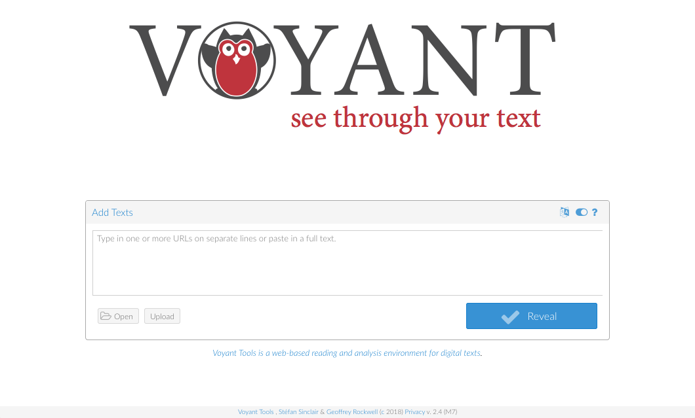

# Introduction à Voyant Tools 

[Voyant Tools](http://voyant-tools.org/) est un environnement d’analyse, de lecture et de visualisation de textes numériques. Cette plateforme fait partie d’un projet plus vaste, présenté dans ce livre : Rockwell Geoffrey et Sinclair Stéfan, *[Hermeneutica](http://hermeneuti.ca/). Computer-Assisted Interpretation in the Humanities*, Cambridge, Massachusetts, MIT Press, 2016.

*Ce document contient la structure et les matériaux d’un atelier francophone d’introduction à Voyant Tools de trois heures. Il se fonde notamment sur un bref [tutoriel disponible sur le site Hermeneuti.ca](http://hermeneuti.ca/intro-workshop), sur des [ateliers antérieurs](http://docs.voyant-tools.org/category/workshops/) assurés par les concepteurs de la plateforme et sur la [documentation en cours de révision](https://voyant-tools.org/docs/#!/guide/tutorial).*

---

## Notre programme

Le but de cet atelier est de vous accompagner dans la découverte de Voyant Tools. Voici le parcours que je vous propose pour comprendre le projet de cette plateforme, guider votre regard dans son interface, vous aider à y analyser des corpus et – qui sait ? – nous faire réfléchir sur le sens et l’intérêt de ces explorations :

1. À propos de Voyant Tools
2. Distances de lecture
3. Faisons le tour de l’atelier numérique
4. Explorez vos corpus !
5. Et ensuite ?

Je vous invite à intervenir à tout moment. En revanche, si vous le voulez bien, nous ferons des présentations rapides dans la seconde partie de l’atelier, après la pause, lorsque chacun reconnaîtra ses intérêts de recherche en lisant la liste des corpus.

---

## 0. Préparatifs

Je vous recommande vivement d’installer la version serveur de Voyant Tools sur votre machine, en suivant ces consignes : <https://github.com/sgsinclair/VoyantServer/wiki/VoyantServer-Desktop>. Cette version vous permettra de faire fonctionner la plateforme localement, sans besoin d’une connexion Internet, sans recours à une mémoire cache et donc en respectant les droits sur les documents et d’éventuels besoins de confidentialité, et surtout plus vite et plus souplement, grâce à la possibilité de relancer le serveur s’il est ralenti ou planté et de manier plus aisément de gros corpus. De plus, aucun risque d’accabler les serveurs au moment de charger les corpus, par exemple pendant un atelier…

Il s’agit simplement de télécharger et décompresser le dossier « VoyantServer2_4-M7.zip » dans le dossier où vous mettez vos applications (prenez la dernière version, quel que soit son numéro), de lancer l’application en double-cliquant sur le fichier « VoyantServer.jar » (votre ordinateur vous demandera peut-être d’[installer Java](https://www.java.com/fr/download/)) et d’attendre que votre navigateur s’ouvre à l’adresse locale par défaut, http://127.0.0.1:8888/ (appuyer sur le bouton « Open Web » a le même effet). Avez-vous pu le faire ? (Au besoin, le fichier est temporairement disponible [ici](https://www.dropbox.com/s/9z8jipcvh8dbaby/VoyantServer2_4-M7.zip?dl=0) et se trouve sur des clés USB qui peuvent circuler.)

Si vous souhaitez explorer un corpus qui vous est familier, il vous suffira de disposer d’un ou de plusieurs fichiers dans un format courant (texte brut de préférence, éventuellement HTML ou XML, voire PDF), ou bien de connaître l’URL d’une page où le texte est accessible librement.

Vous pouvez faire des essais avant l’atelier pour vous assurer que votre version locale fonctionne aussi bien que le site canadien, <https://voyant-tools.org>, ou son miroir français <http://voyant.tools.huma-num.fr>.

## 1. À propos de Voyant Tools

> Voyant Tools is a web-based text analysis, reading and visualization environment. Developed by a small team of digital humanities scholars led by Stéfan Sinclair and Geoffrey Rockwell, Voyant Tools is designed for a very wide range of applications and users, from students to researchers and journalists to market analysts. It strives to balance user-friendliness with a range of analytic and interpretive functions. (Fichier [*Readme*](https://github.com/sgsinclair/Voyant/blob/master/README.md) de l’entrepôt GitHub contenant le code de Voyant Tools)

* Étapes du projet
    * Depuis les années 1990 : Humanities Computing et Digital Humanities au Canada (cf. [TAPoR](http://tapor.ca/home), the Text Analysis Portal for Research)
    * Dans les années 2000 : HyperPo
    * À partir de 2008 environ : Voyeur (Flash et Java)
    * Depuis 2015 : Voyant 2.0 (HTML5, amélioration des filtres de requête, outils fondés sur le calcul de proximité et les séquences d’éléments, ou *n-grams*)
* Principes
    * Ouverture du code, ouverture à la contribution
    * Manipuler, explorer, fouiller les corpus textuels (les Text Analysis Recipes de TAPoR étaient des « recettes »)
    * « [S]howing how analytical tools *are* instantiations of interpretive methods that can be woven closely into other hermeneutical things, like text » (*Hermeneutica*, p. 4)
* Voyant et [moi](https://aurelienberra.org/) (ou : pourquoi je suis ici)
    * Je me souviens que Stéfan Sinclair participait au [Day of DH](http://stefansinclair.name/rapid-analysis-dayofdh11/) au début des années 2010… Je découvrais ce champ de recherche, après une thèse de grec ancien. Voyeur/Voyant semblait incarner bon nombre des valeurs, des traditions et des questions d’une communauté.
    * Depuis 2014, j’utilise Voyant Tools dans mon enseignement : au premier semestre du master [Humanités classiques et humanités numériques](https://classnum.hypotheses.org/1125), pour initier à l’analyse textuelle, outiller l’exercice des pastiches savants et faire toucher du doigt les avantages et les limites d’une plateforme généraliste.
    * En 2016, j’ai réalisé la traduction française de l’interface, à la suite d’une discussion sur la liste « [Digital Humanities](https://groupes.renater.fr/sympa/info/dh) ».
    * En 2017-2018, j’ai produit des listes de [*stopwords* pour le grec et le latin](https://github.com/aurelberra/stopwords), qui ont été intégrées à Voyant Tools.
* Il existe une tension entre l’idéal, ou la tentation, de l’outil unique omnipotent et la lente acquisition d’une culture computationnelle donnant accès à des outils spécialisés (encodage, transformation, analyse textuelle, analyse de réseaux, visualisation de données, etc.), à leur adaptation, voire à leur création. Voyant Tools résout en partie cette tension par sa modularité et son caractère évolutif.
* La prochaine étape sera celle des carnets Spyral. Au delà de l’intégration des outils dans le texte, il s’agit de publier des *notebooks* alliant code et commentaire, analyse et argumentation, en acclimatant la tradition du *literate programming* aux sciences humaines et sociales (voir le [poster](http://journalofdigitalhumanities.org/2-3/voyant-notebooks-literate-programming-and-programming-literacy/) programmatique des auteurs, ainsi que les parallèles du projet [Jupyter](http://jupyter.org/) et du [Rmarkdown](https://rmarkdown.rstudio.com/)). Voyant Tools est sans doute le type de projets qui nous conduit vers une culture numérique et statistique mieux partagée.

## 2. Distances de lecture

`Cirrus`. Observez le [nuage de mots](http://voyant-tools.org/tool/Cirrus/?corpus=frankenstein&toolFlow=contexts) reproduit ci-dessus. Que représente ce nuage, à votre avis ? Parmi ses caractéristiques, lesquelles sont issues d’une quantification du texte ? Comment ses autres propriétés sont-elles générées ? Tous les mots vous semblent-ils pertinents ? Manque-t-il des mots ?
<!-- manipuler les paramètres du nuage + modifier les *stopwords* -->

Pour découvrir l’interface de Voyant, observons maintenant un autre texte de plus près, à d’autres échelles, au prisme d’autres outils : le premier [*Faust*](http://beta.faustedition.net/print/faust1.all) de Goethe, importé par son URL. Si vous ne lisez pas l’allemand, cela vous aidera à vous concentrer sur l’environnement de travail !

`Termes`/`Terms`. La fondamentale table des fréquences. Avez-vous vu les colonnes cachées ? Connaissiez-vous les *sparklines* ?

`Lecteur`/`Reader`. Que se passe-t-il si vous survolez un mot, si vous le sélectionnez ? Que représente la frise située sous le texte ? Avez-vous testé les fonctions de requête ?

`Contextes`/`Contexts`. L’indispensable concordance (du type Keyword in Context, KWIC). Avez-vous remarqué les curseurs, en particulier celui qui se nomme « Contexte » ? Un menu vous donne par ailleurs la possibilité de restreindre le corpus à certains documents.

## 3. Faisons le tour de l’atelier numérique

Maintenant, observons l’environnement de travail complet, en revenant à la page d’accueil de Voyant pour ouvrir l’un des deux corpus proposés par défaut, le [corpus de Shakespeare](http://voyant-tools.org/?corpus=shakespeare).

La configuration par défaut de Voyant combine un ensemble d’outils, ou modules, qui sont complémentaires et parfois coordonnés. Remarquez que des panneaux supplémentaires sont présents lorsque vous travaillez sur une collection de textes.

Pour naviguer dans cet environnement, vous devez comprendre quelques principes de fonctionnement d’une **vue** :

* À chaque **outil** correspond un **panneau**, que vous pouvez réduire ou agrandir.
* Pour chaque panneau, des **options** sont disponibles. Survolez, puis cliquez.
* Chaque panneau peut être manipulé ou exploré d’une façon qui lui est propre.
* Chaque panneau peut modifier le contenu d’autres panneaux.

Avant de cliquer pour remplacer un outil par un autre, prenez le temps de regarder la liste des outils. Elle est structurée en catégories non exclusives, selon les échelles de lecture et les types de présentation.

Voyant Tools propose actuellement 24 outils en ligne (voir la [documentation](http://voyant-tools.org/docs/#!/guide/tools)). Certains d’entre eux font partie des fondements de la linguistique de corpus ou de la linguistique computationnelle (dénombrement, concordance, co-occurrence), certains sont en vogue dans les humanités numériques (modélisation thématique, ou *topic modelling*), certains sont plus expérimentaux ou artistiques (lesquels, à votre avis ?). D’autres outils sont en préparation (par exemple un outil de cartographie lié à une fonction de reconnaissance des entités nommées).

Nous verrons dans quelques minutes comment créer un corpus en important du texte.

Les fonctions d’export dépendent de l’outil concerné. Elles peuvent fournir :

* une référence bibliographique comportant les noms des concepteurs, de la plateforme et de l’outil
* une image produite par un outil (formats PNG et SVG)
* d’autres types de données produites par un outil (formats HTML, TSV et JSON)
* une nouvelle URL pour afficher un outil séparément, dans la fenêtre entière du navigateur
* un fragment de code pour intégrer le panneau ou la vue à une page HTML (une capsule est créé par une balise *iframe*, qui fait appel à l’API de Voyant Tools ; certains CMS, comme WordPress, sont notoirement rétifs à cette procédure)

Notez qu’il est parfois utile d’ouvrir plusieurs interfaces et de comparer des corpus, par exemple une version sans lemmatisation et une version lemmatisée d’un texte, ou bien un texte dans sa langue originale et une traduction.

Vous aurez déjà constaté que la fonction d’aide apparaît dans tous les panneaux.

Voici les outils que je vous propose de commenter brièvement :

* `Résumé`/`Summary`
* `Documents`
* `Syntagmes`/`Phrases`
* `Tendances`/`Trends`
* `Corrélations`/`Correlations` <!-- évoquer les erreurs occasionnelles -->
* `Collocations`/`Collocates`
* `Liens`/`Links`
* `Nuage de points`/`Scatter plot` <!-- redimensionner, puis plein écran -->
* `Thèmes`/`Topics`

## Pause 

## 4. Explorez vos corpus !

### Créer un corpus

Vous êtes maintenant prêts à charger vos propres corpus dans Voyant. Utilisez la version locale que vous avez installée sur votre ordinateur, ou bien l’un des serveurs suivants :

* avec une interface dans la langue de votre navigateur : <http://voyant.tools.huma-num.fr> ou <https://voyant-tools.org>
* avec l’interface française : <http://voyant.tools.huma-num.fr/?lang=fr> ou <https://voyant-tools.org/?lang=fr>
* avec l’interface anglaise : <http://voyant.tools.huma-num.fr/?lang=en> ou <https://voyant-tools.org/?lang=en>

Remarquez en passant que certains paramètres peuvent être contrôlés par une modification de l’URL de base. De même, l’URL de votre corpus peut vous servir de signet.

Voyant vous autorise à créer un corpus de plusieurs manières :

* Vous pouvez **copier-coller** du texte.
* Vous pouvez saisir une **URL** que Voyant ira visiter. Par exemple, nous pourrions récupérer une page sur le blog de Geoffrey Rockwell, [*theoreti.ca*](http://theoreti.ca/?p=6484), ou bien sur celui de François Bon, [*Le Tiers Livre*](http://www.tierslivre.net/arch/00_Azerty.html), ou encore plusieurs pages d’une ou de plusieurs sources.
* Vous pouvez **charger** un texte à partir d’un ou plusieurs fichiers (texte brut, HTML, XML, RTF, DOCX, PDF – ou archive ZIP contenant des fichiers dans d’autres formats).
* Vous pouvez **ouvrir** l’un des corpus qui sont disponibles par défaut, au moyen du bouton « Ouvrir ».

### Démonstration sur quelques corpus
* Français, via des URL <!-- détailler les options d’import -->
    * Lautréamont, [*Les Chants de Maldoror*](http://athena.unige.ch/athena/lautreamont/laut_mal.html)
    <!-- stopwords, « yeux » et « corps », pas de modification de la tokénisation (« n’est » et « l’homme ») -->
    * Rabelais, [*Pantagruel*](http://athena.unige.ch/athena/rabelais/rabelais_pantagruel.html) <!-- pas de stopwords adaptés, distribution du nom de Pantagruel -->
        * Intégration à une page HTML : [exemple 1](https://aurelienberra.org/temp/voyant.html) et [code](https://github.com/aurelberra/aurelienberra/blob/master/static/temp/voyant.html)
        * Intégration à une page HTML : [exemple 2](http://voyant-tools.org/docs/#!/guide/search), la page documentant les modes de requête
* Latin, via des fichiers
    * César, *La Guerre des Gaules*, texte du PHI5 nettoyé
    <!-- sélectionner une liste de stopwords, pas de lemmatisation -->
    * César, *La Guerre des Gaules*, même texte lemmatisé puis un peu nettoyé
    <!-- texte lemmatisé avec le module du CLTK : évoquer le « pre-processing », que VT réduit au minimum -->
    <!-- (erreurs comme « ito » pour « iter », « itaque », « item »… ; rectifié « edo » pour « sum », « reor » pour « res », « bellus » pour « bellum », « neo » pour « ne », « dius » pour « dies », et quelques autres formes ; lemmatisé les entités nommées « Gallia », « Caesar » et « Romani/Romanus ») -->
    <!-- « con » est la trace des choix du lemmatiseur (« con- ») -->
* Français, textes issus du Web, via des fichiers HTML
    * François Bon, [*Le Tiers Livre*](http://www.tierslivre.net/)
    <!-- acquisition des données : wget -->
* Français, espagnol et anglais, textes issus du Web, via des fichiers XML
    * [*Digital Humanities Quarterly* 12.1](http://www.digitalhumanities.org/dhq/vol/12/1/) : humanités numériques hispanophones et francophones
    <!-- j’ai exclu 4 fichiers XML en raison d’une erreur de lecture de certains nœuds -->
    <!-- sélectionner la liste de stopwords « multilingue », éditer les listes (enlever par exemple « digital http humanities dhq university ») -->

Les corpus créés sur le serveur de Voyant Tools ont une certaine pérennité : ils demeurent accessibles tant qu’ils sont visités régulièrement, par exemple une fois toutes les trois semaines.

### Travail en groupes

Formez des groupes. Chaque groupe choisit un corpus et explore quelques outils. Vous pourrez ensuite partager avec tous :
* des observations sur votre corpus
* des remarques ou des questions sur Voyant Tools

#### Corpus des participants

Le formulaire d’inscription m’a donné un aperçu de vos domaines d’intérêt, de vos compétences numériques et de vos attentes – qui sont d’une réjouissante hétérogénéité. Cherchons à rendre compte de cette diversité dans les groupes !

* Médias
    * images de manuscrits
    * images d’imprimés
    * textes numériques <!-- VT est texto-centrique -->
    * textes et images

* Types
    * textes littéraires, de prose ou de poésie
    * textes critiques
    * corpus philosophiques (Leibniz, Hume, Quine, Goodman, Putnam, Searle, Davidson, Kripke, etc.)
    * textes documentaires
    * journaux
    * documents juridiques <!-- VT est-il un instrument adapté ? -->
    * nouvelles de médias en ligne et messages de réseaux sociaux numériques <!-- accès libre ? -->
    * corpus d’entretiens
    * œuvres musicales <!-- quel encodage ? -->

* Langues
    * allemand
    * anglais
    * français (ancien)
    * français (moyen)
    * français (moderne)
    * français (contemporain)
    * latin

* Époques
    * textes hagiographiques médiévaux
    * textes hagiographiques
    * édition critique d’un texte de Christine de Pizan <!-- édition critique / texte brut -->
    * texte didactique de Christine de Pizan
    * textes en ancien et moyen français
    * partition musicale (ms. Turin Biblioteca Nazionale T.III.2)
    * commentaires humanistes latins sur l’*Art poétique* d’Horace
    * manuscrits du XVIe siècle
    * 200.000 vers de poésie du XVIe siècle (corpus XML, en partie lemmatisé) <!-- lemmatisation -->
    * chroniques missionnaires
    * journaux du XVIIIe siècle <!-- orthographe, OCR -->
    * corpus de textes esthétique allemande deuxième moitié du XIXe siècle
    * Zola, *Les Rougon-Macquart*
    * Maeterlinck
    * ouvrages d’historiographie imprimés
    * romans du XXe siècle 
    * 100 œuvres de littérature de l’imaginaire pour jeunes adultes à succès
    * texte ultra-contemporain de François Bon <!-- merci pour l’idée ! -->
    * corpus de pages Facebook
    * corpus bruts Youtube <!-- commentaires ? -->
    * corpus de flux RSS « print » et « Web » <!-- VT les supporte, mais je n’ai jamais essayé -->

#### Partageons nos remarques, questions et impressions

Que pensez-vous de ce premier contact avec vos corpus dans Voyant Tools ?

## 5. Et ensuite ? 

Outre la version française (sur le serveur de [Voyant Tools](https://voyant-tools.org/?lang=fr) ou sur celui d’[Huma-Num](http://voyant.tools.huma-num.fr/?lang=fr), des versions dans d’[autres langues](http://voyant-tools.org/docs/#!/guide/languages) sont mises en ligne à mesure que des collègues traduisent l’interface. La [version serveur](https://github.com/sgsinclair/VoyantServer/#voyant-server) de Voyant Tools vous permet de faire fonctionner localement la plateforme. Le [code](https://github.com/sgsinclair/Voyant) de la plateforme est publié en *open source* (licence GPL).

Vous pouvez consulter le [manuel de Voyant Tools](http://voyant-tools.org/docs/#!/guide/start) (licence CC-BY). Un [tutoriel](https://voyant-tools.org/docs/#!/guide/tutorial) destiné à servir de base pour l’organisation d’ateliers ou de formations est en cours de rédaction. Pour savoir qui a fait quoi, selon quels principes et en employant quelles technologies, la page [*About*](https://voyant-tools.org/docs/#!/guide/about) de cette documentation est tout indiquée. La [*Gallery*](https://voyant-tools.org/docs/#!/guide/gallery) fournit des exemples très variés.

[Hermeneutica](http://hermeneuti.ca/) illustre l’insertion de panneaux de Voyant dans des essais en ligne.

Enfin, vous pouvez contacter les concepteurs, Geoffrey Rockwell (<geoffrey.rockwell@ualberta.ca>) et Stéfan Sinclair (<stefan.sinclair@mcgill.ca>). Sur Twitter, le compte [@VoyantTools](https://twitter.com/VoyantTools) est un efficace canal d’information sur les évolutions de la plateforme et les usages que d’autres utilisateurs en font.

Toutes vos remarques sur cet atelier, ou sur l’interface francophone, sont bienvenues : Aurélien Berra (<aurelien.berra@parisnanterre.fr>).

Bonnes lectures à vous !

