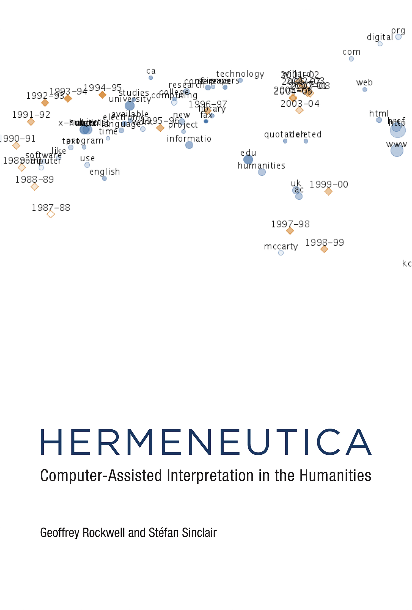

> Ce document est une version française mise à jour et modifiée d’un bref [tutoriel disponible sur le site Hermeneuti.ca](http://hermeneuti.ca/intro-workshop). Il contient la structure et les matériaux en vue d’un atelier francophone d’introduction à Voyant Tools de trois heures.

# Introduction à Voyant Tools

[Voyant Tools](http://voyant-tools.org/) est un environnement de lecture et d’analyse de textes numériques. Cette plateforme fait partie d’un projet plus vaste, présenté dans ce livre : Rockwell Geoffrey et Sinclair Stéfan, *[Hermeneutica](http://hermeneuti.ca/). Computer-Assisted Interpretation in the Humanities*, Cambridge, Massachusetts, MIT Press, 2016.

## Programme de l’atelier

* Observer un texte à diverses distances
* Utiliser un environnement de travail numérique et ses outils
* Faire des essais avec vos propres corpus
* Pour en savoir plus et obtenir de l’aide

## Observez ce [nuage de mots](http://voyant-tools.org/tool/Cirrus/?corpus=frankenstein&toolFlow=contexts)

* Que représente à votre avis ce nuage ?
* Quelles caractéristiques sont issues d’une quantification du texte ? Comment les autres propriétés du nuage sont-elles générées ?
* Quels sont les mots qui manquent ?

Manipulez ce nuage à votre tour. Ou bien essayez avec ce corpus de [Shakespeare](http://voyant-tools.org/tool/Cirrus/?corpus=shakespeare&stopList=stop.en.taporware.txt&toolFlow=contexts).

## Utiliser un environnement de travail numérique et ses outils

Maintenant, observez cet [environnement complet de Voyant](http://voyant-tools.org/?corpus=frankenstein&stopList=stop.en.taporware.txt). Il s’agit de l’apparence par défaut. Elle combine un ensemble d’outils, ou modules, qui sont complémentaires et coordonnés. Pour l’utiliser, vous devez comprendre quelques principes de fonctionnement d’une **vue** :

* À chaque **outil** correspond un **panneau**, que vous pouvez réduire ou agrandir.
* Pour chaque panneau, des options sont disponibles.
* Chaque panneau peut être manipulé ou exploré d’une façon qui lui est propre.
* Chaque panneau peut modifier le contenu d’autres panneaux.

Faites des essais dans l’environnement par défaut de Voyant avec un texte unique, puis avec le [corpus de Shakespeare](http://voyant-tools.org/?corpus=shakespeare). Remarquez que des panneaux supplémentaires sont présents lorsque vous travaillez sur une collection de textes.

## Faire des essais avec vos propres corpus

Vous êtes maintenant prêts à charger vos propres corpus dans Voyant. Utilisez la version locale que vous avez installée sur votre ordinateur, ou bien l’un des serveurs suivants :

* avec une interface dans la langue de votre navigateur : [http://voyant.tools.huma-num.fr](http://voyant.tools.huma-num.fr) ou [https://voyant-tools.org](https://voyant-tools.org/)
* avec l’interface française : [http://voyant.tools.huma-num.fr/?lang=fr](http://voyant.tools.huma-num.fr/?lang=fr) ou [https://voyant-tools.org/?lang=fr](https://voyant-tools.org/?lang=fr)
* avec l’interface anglaise : [http://voyant.tools.huma-num.fr/?lang=en](http://voyant.tools.huma-num.fr/?lang=en) ou [https://voyant-tools.org/?lang=en](https://voyant-tools.org/?lang=en)

Voyant vous permet de charger un texte de plusieurs manières :

* Vous pouvez **copier-coller** du texte.
* Vous pouvez saisir une **URL** que Voyant ira visiter pour récupérer du texte. Par exemple, nous pourrions utiliser Voyant pour observer le contenu du blog de Geoffrey Rockwell, [http://theoreti.ca](http://theoreti.ca/), ou bien @URL-fr.
* Vous pouvez **charger** un texte à partir d’un fichier.
* Vous pouvez **ouvrir** l’un des corpus qui sont disponibles par défaut, au moyen du bouton `Ouvrir`.

## Références et exemples

Voici quelques extensions ou variantes de Voyant qui peuvent vous intéresser :

* Outre la version française, <https://voyant-tools.org/?lang=fr>, des versions dans d’[autres langues](http://voyant-tools.org/docs/#!/guide/languages) sont mises en ligne à mesure que des collègues traduisent l’interface.
* [Hermeneutica](http://hermeneuti.ca/) montre de quelle manière on peut intégrer des panneaux de Voyant dans des essais en ligne.
* @alia

## Pour en savoir plus et obtenir de l’aide

Le manuel de Voyant est disponible à cette adresse : <http://voyant-tools.org/docs/#!/guide/start> (licence CC-BY).

Le code de Voyant Tools est publié en *open source* : <https://github.com/sgsinclair/Voyant> (licence GPL).

La version serveur de Voyant Tools peut être téléchargée sur <https://github.com/sgsinclair/VoyantServer/#voyant-server>. Elle vous permet de faire fonctionner localement la plateforme.

Vous pouvez contacter les concepteurs : Geoffrey Rockwell (<geoffrey.rockwell@ualberta.ca>) et Stéfan Sinclair (<stefan.sinclair@mcgill.ca>). En ce qui concerne la version francophone, n’hésitez pas à écrire à Aurélien Berra (<aurelien.berra@parisnanterre.fr>).

Voyant a un compte sur Twitter, [@VoyantTools](https://twitter.com/VoyantTools), qui vous fera découvrir les usages que d’autres utilisateurs font de la plateforme.
